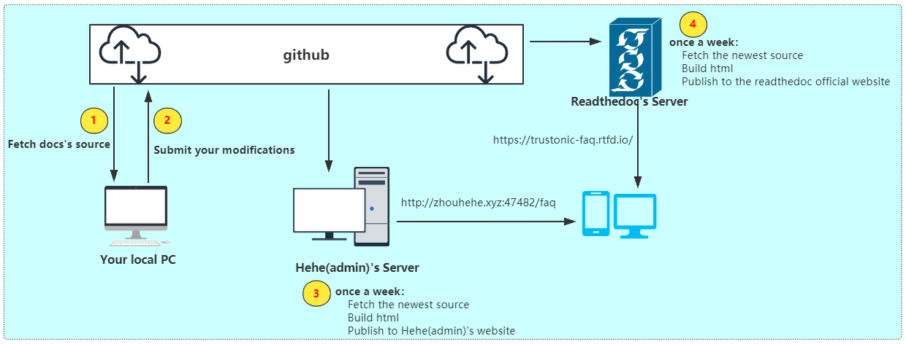

## 如何参与该文档的开发

我们鼓励每一个程序员记录一下项目中所遇到的trustonic_tee相关问题，并将其分享出去.
当下次有人遇到问题时，可以来FAQ查找，看看是否有相同或相似问题...

<font color=red size=4>如果您想参与该文档开发，请联系我，手把手地教</font>




#### 1、拉取文档源码

```c
git clone https://github.com/baronZhou/FAQ_TT.git
```

#### 2、搭建编译文档的环境

**(1) 安装必要工具**
```c
sudo apt install git make python3 python3-pip
```

**(2) 安装依赖包**
```c
pip install -r rquirements.txt
```

**(3) 编译**
```c
make html
```

#### 3、编译后使用浏览器打开
编译后输出build/html/index.html文件，用浏览器打开即可看到漂亮的网页

#### 4、贡献自己的修改

文档的源码都在source目录下，以md文件为主。你可以添加自己的文件，或在原有的文件上修改.
修改之后在github上发起pull request. 等待owner的review和merge

该github repository已托管到readthedocs，该文档一天一次会被自动同步到readthedocs上
[readthedocs链接点击此处](https://trustonic-faq.readthedocs.io/en/latest/)
